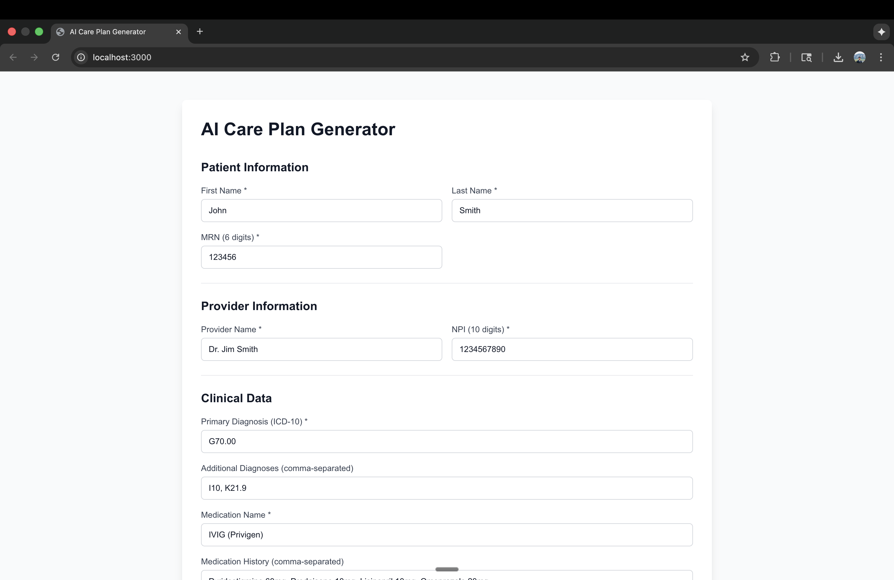
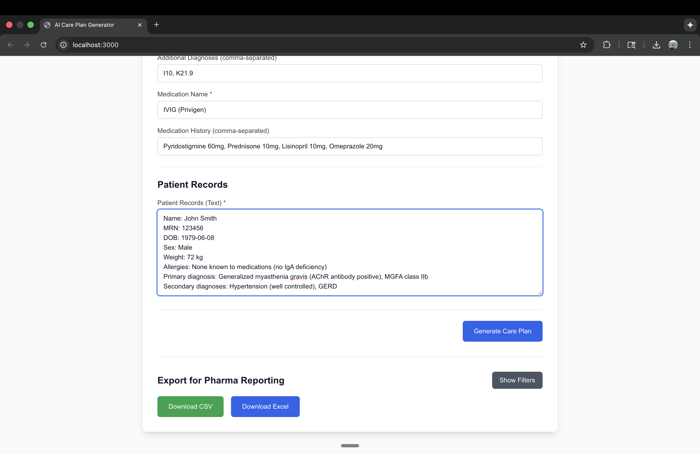
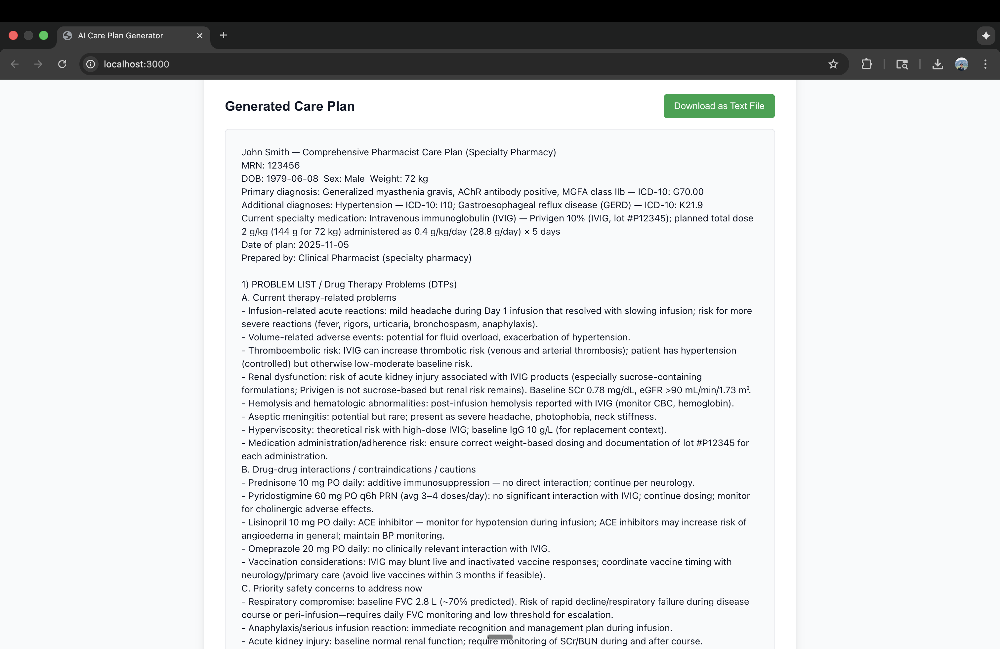
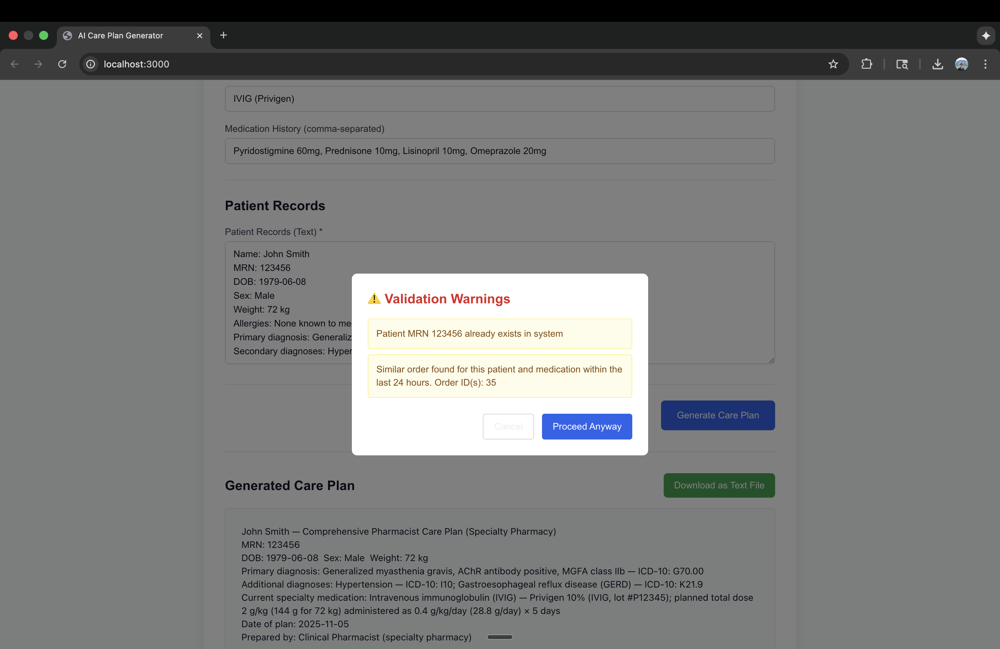

# AI Care Plan Generator

A web application for generating comprehensive pharmacist care plans using AI, with duplicate detection and pharma reporting export capabilities.

## Features
- P0 Features
- **AI-Powered Care Plan Generation**: Automatically generates Medicare-compliant care plans using AI
- **Duplicate Detection**: Validates patient, provider, and order data to prevent duplicates
- **Data Validation**: Real-time form validation with user-friendly error messages
- **Warning System**: Modal alerts for duplicate warnings before proceeding

- P1 Feature
- **Pharma Reporting Export**: Export orders to CSV or Excel file


## Tech Stack

- **Backend**: Django REST Framework, SQLite (Database)
- **Frontend**: Next.js, React, TypeScript, Tailwind CSS
- **AI**: OpenAI API (GPT-5-mini)

## Setup

### Backend

1. Navigate to the backend directory:
   ```bash
   cd backend
   ```

2. Create and activate a virtual environment:
   ```bash
   python -m venv venv
   source venv/bin/activate 
   ```

3. Install dependencies:
   ```bash
   pip install -r requirements.txt
   ```

4. Create a `.env` file in the backend directory:
   ```
   OPENAI_API_KEY=your_openai_api_key_here
   ```

5. Run migrations:
   ```bash
   python manage.py migrate
   ```

6. Start the server:
   ```bash
   python manage.py runserver
   ```

The backend will run on `http://localhost:8000`

### Frontend

1. Navigate to the frontend directory:
   ```bash
   cd frontend
   ```

2. Install dependencies:
   ```bash
   npm install
   ```

3. Create a `.env.local` file (optional, defaults to `http://127.0.0.1:8000`):
   ```
   BACKEND_URL=http://localhost:8000
   ```

4. Start the development server:
   ```bash
   npm run dev
   ```

The frontend will run on `http://localhost:3000`

## Demo Usage

1. Fill out the patient and provider information form
2. Enter clinical data including diagnosis codes and medication information
3. Paste or enter patient records
4. Click "Generate Care Plan"
5. Review any duplicate warnings if they appear
6. Download the generated care plan or export data for reporting

## UI Screenshots









Check the file generated_care_plan_file.txt to see the sample generated care plan for the above UI screenshot data

## API Endpoints

- `POST /api/orders/validate` - Validate order data
- `POST /api/orders/generate` - Generate care plan
- `GET /api/orders/export` - Export orders (CSV/Excel)
- `GET /api/orders/export/stats` - Get export statistics
- `GET /api/orders` - List all orders

## Environment Variables

- `OPENAI_API_KEY` - Your OpenAI API key (required)
- `BACKEND_URL` - Backend API URL (frontend only, optional)
